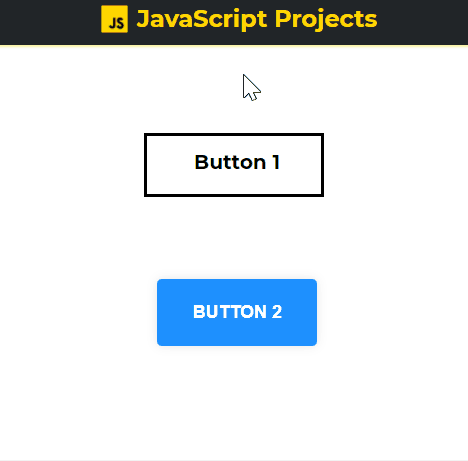

# Buttons

<b>All your favorite buttons in one place! 🕹</b>

## <a href="https://xjqx.github.io/JavaScript-Projects/Buttons/">Website</a>

</img>

## Features:
- **`Different Styles of Buttons`**

- **`Buttons link to css file`**
