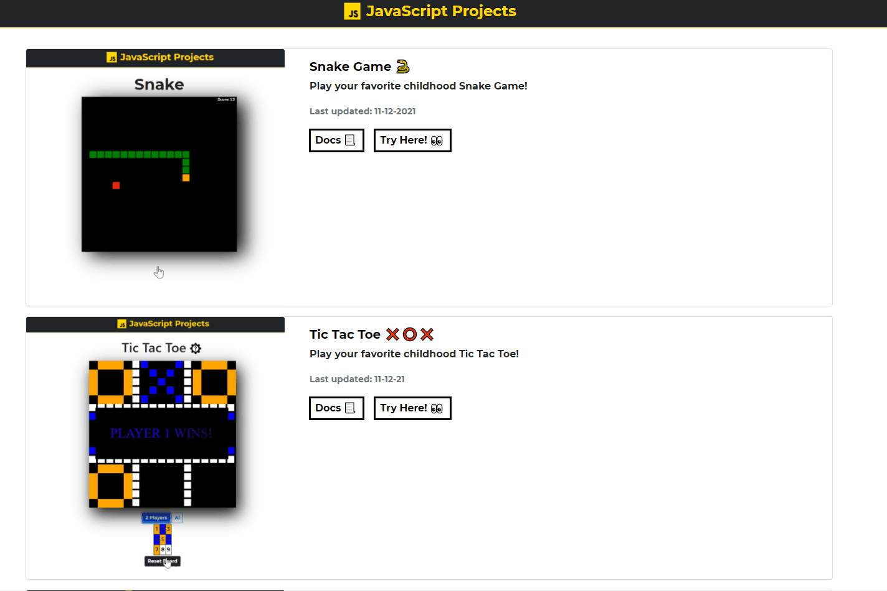

# JavaScript Projects

<b>Collection of Mini JavaScript Projects</b>

## 🌐 <a href="https://xjqx.github.io/JavaScript-Projects/">Main Website</a>

🌧 <a href="https://github.com/xJQx/JavaScript-Projects/tree/main/Weather_Forecast">Weather Forecast</a> 
🧮 <a href="https://github.com/xJQx/JavaScript-Projects/tree/main/Calculator2">Calculator v2</a> 
🧮 <a href="https://github.com/xJQx/JavaScript-Projects/tree/main/Calculator">Calculator</a> 
🐍 <a href="https://github.com/xJQx/JavaScript-Projects/tree/main/Snake_Game">Snake Game</a> 
❌ <a href="https://github.com/xJQx/JavaScript-Projects/tree/main/TicTacToe">Tic Tac Toe</a> 

