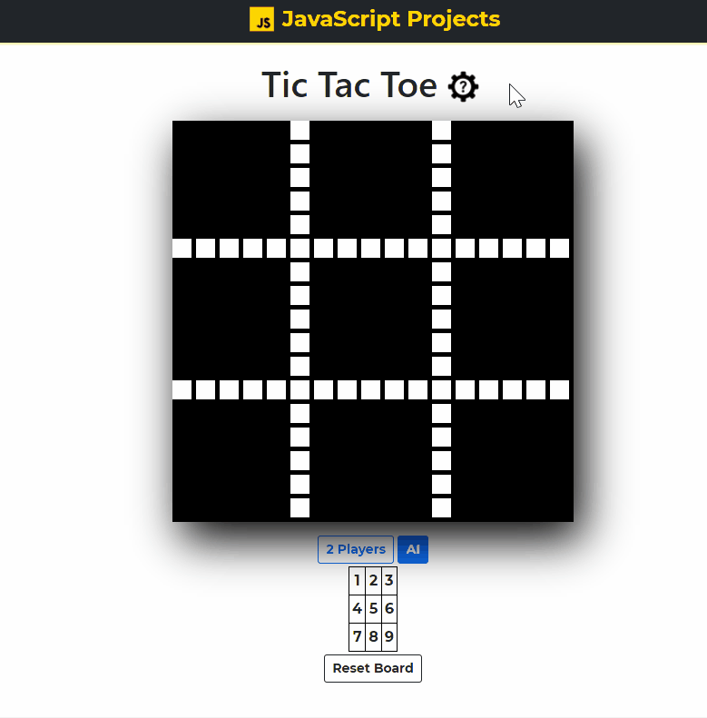

# Tic Tac Toe Game with JavaScript

<b>Play your favorite childhood Tic Tac Toe! ❌⭕❌</b>

## <a href="https://xjqx.github.io/JavaScript-Projects/TicTacToe/">Website</a>

## Features:
- **`2 Modes:`**
  - 2 Players
  - AI
- **`AI mode checking`**
  - When changing from 2 players mode to AI mode, both players must complete their move
- **`Move Display`**
  - Making a move will color a mini box and draw a symbol (circle/cross)
- **`Display Winner/Tie`**
  - Check for win conditions

- **`Reset Board`**
