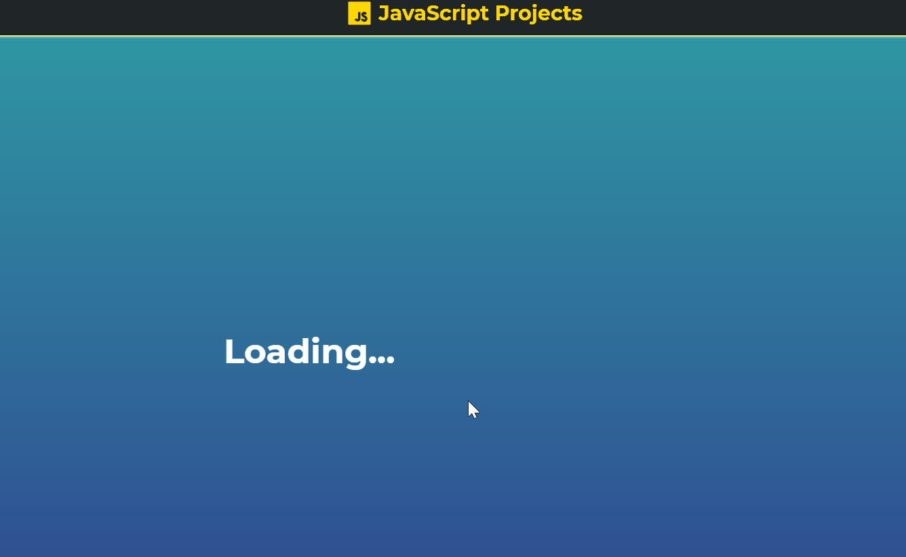

# Weather Forecast 

<b>🌧 See if you need an umbrella! ☔</b>

## <a href="https://xjqx.github.io/JavaScript-Projects/Weather_Forecast/">Website</a>

</img>

## Features:
- **`Visual Crossing Weather API`**

- **`Skycons Icons`**

- **`Forecast`**
  - See weather 5 days into the future

- **`Switch Temp Symbol`**
  - Switch between `F` and `C`

- **`Single Page Display`**
  - ***Loading*** Screen
  - ***Current*** Weather Condition Screen
  - ***Forecast*** Weather Condition Screen
 
 - **`Mobile Responsive`**
 
